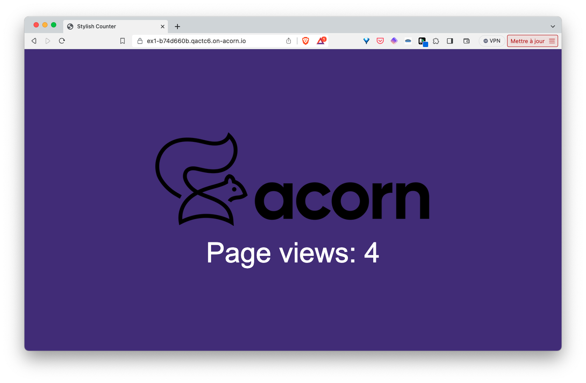

## Purpose

This folder defines an Acorn service which creates a Postgres Neon database on the fly. To create the Mongo cluster, the Acorn interacts with NEON's API with user provided credentials.

Currently the postgres database is created by default in the AWS US-EAST-1 region.

## Neon Credentials

To use this service you need to have a Neon account and to create an API Key. Once deployed, you can click on the "cred-helper" link in the UI or from the CLI status. The link will open a browser page that instructs you how to get API key for Neon.

Once you save the credentials through the UI form, the database will be created.

## Usage

The [examples folder](./examples) contains a sample application using this Service. This app consists in a Python backend based on the FastAPI library, it displays a web page indicating the number of times the application was called, a counter is saved in the underlying Postgres database and incremented with each request. The screenshot below shows the UI of the example application.



To use the Postgres Neon Service, we first define a *service* property in the Acornfile of the application:

```
services: db: {
  image: "ghcr.io/acorn-io/neon:v#-#"
}
```

Next we define the application container. This one can connect to the Postfgres Neon service via environment variables which values are set based on the service's properties.

```
containers: {
  app: {
    build: {
   context: "."
   target:  "dev"
  }
    consumes: ["db"]
    ports: publish: "8000/http"
    env: {
      DB_HOST:  "@{service.db.address}"
      DB_NAME:  "@{service.db.data.dbName}"
      DB_USER:  "@{service.db.secrets.user.username}"
      DB_PASS:  "@{service.db.secrets.user.password}"
    }
  }
}
```

This container is built using the Dockerfile in the examples folder. Once built, the container consumes the Postgres Neon service using the address and credentials provided through via the dedicated variables.

This example can be run with the following command (to be run from the *examples* folder)

```
acorn run -n app
```

After a few tens of seconds an http endpoint will be returned. Using this endpoint we can access the application and see the counter incremented on each reload of the page.

## Running the app in Acorn Sandbox

Instead of managing your own Acorn installation, you can deploy this application in the Acorn Sandbox, the free SaaS offering provided by Acorn. Access to the sandbox requires only a GitHub account, which is used for authentication.

[](https://acorn.io/run/ghcr.io/acorn-io/postgres-neon/examples:v%23-%23)

An application running in the Sandbox will automatically shut down after 2 hours, but you can use the Acorn Pro plan to remove the time limit and gain additional functionalities.

## Consume an existing secret

This Acorn will need credentials to interact with the Neon API. These credentials are stored in a secret named *neon-creds*. This secret needs to be created ahead of time by the user.

```
acorn secrets create \
  --type opaque \
  --data api_key=$NEON_API_KEY \
  neon-creds
```

You will need to launch the acorn with the following argument set: `--useExternalCreds`
This will tell Acorn to use the external secret instead of prompting for one.

## Status

This service is still a work in progress. Feedback are welcome.
